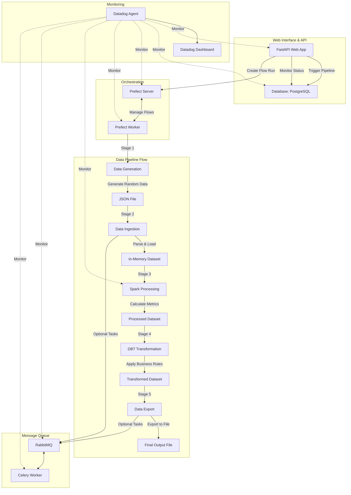

# Datadog Data Pipeline Demo

This project demonstrates how to use Datadog to monitor a Python-based data processing stack. The demo includes a fully functional data pipeline that simulates real-world data processing using several popular technologies.

## Architecture and Flow Diagram

The demo simulates a complete end-to-end data pipeline with the following components and flow:



## Component Responsibilities

| Component      | Technology        | Responsibility                                |
| -------------- | ----------------- | --------------------------------------------- |
| Web Interface  | FastAPI           | Provides UI to trigger and monitor pipelines  |
| Database       | PostgreSQL        | Stores pipeline metadata and execution status |
| Orchestration  | Prefect           | Manages workflow execution and monitoring     |
| Queuing        | RabbitMQ + Celery | Handles asynchronous task distribution        |
| Processing     | PySpark           | Performs distributed data processing          |
| Transformation | dbt-core          | Applies business logic and transformations    |
| Monitoring     | Datadog           | Collects metrics, traces, and logs            |

## Pipeline Stages

1. **Data Generation**:

   - Creates random structured data in JSON format
   - Simulates real-world data sources

2. **Data Ingestion**:

   - Reads and parses the input data
   - Prepares data for processing

3. **Spark Processing**:

   - Performs distributed data processing
   - Calculates key metrics and transformations
   - Adds computed fields to each record

4. **dbt Transformation**:

   - Applies business rules and logic
   - Categorizes and enriches the data
   - Adds business-specific metrics

5. **Data Export**:
   - Writes the final processed data to output files
   - Makes data available for downstream systems

## Prerequisites

- Docker and Docker Compose
- Datadog account (optional for monitoring features)

## Quick Start

1. Clone this repository:

   ```
   git clone <repository-url>
   cd datadog-demo
   ```

2. (Optional) Set up Datadog:

   - Add your Datadog API key to the `.env` file

3. Start the application:

   ```bash
   # Without Datadog monitoring
   docker-compose up -d

   # With Datadog monitoring (if API key is set)
   docker-compose --profile with-datadog up -d
   ```

4. Access the web interface:

   ```
   http://localhost:8000
   ```

5. Run a data pipeline:
   - Navigate to the web interface
   - Click "Trigger New Pipeline" to start a data processing run
   - Watch the pipeline progress through the UI

## Components

- **FastAPI UI**: Available at http://localhost:8000
- **Prefect UI**: Available at http://localhost:4200
- **RabbitMQ Management**: Available at http://localhost:15672 (guest/guest)
- **Postgres**: Available at localhost:5432
- **Spark Master UI**: Available at http://localhost:8080

## File Structure

```
datadog-demo/
├── app/                      # FastAPI application
│   ├── main.py               # Main application file
│   ├── api/                  # API routes
│   ├── db/                   # Database models
│   ├── pipeline/             # Pipeline flows
│   ├── templates/            # HTML templates
│   └── static/               # Static files
├── data/                     # Data directory
│   ├── input/                # Input data files
│   └── output/               # Output data files
├── docker-compose.yml        # Docker Compose configuration
├── Dockerfile                # Docker build instructions
├── requirements.txt          # Python dependencies
└── .env                      # Environment variables
```

## Monitoring with Datadog

If you've set up Datadog, you can monitor:

- APM traces of the entire pipeline process
- Metrics from all services
- Logs from the application
- Infrastructure metrics

## Customization

You can modify the pipeline by:

- Changing the number of records generated
- Adding new transformation stages
- Modifying the processing logic
