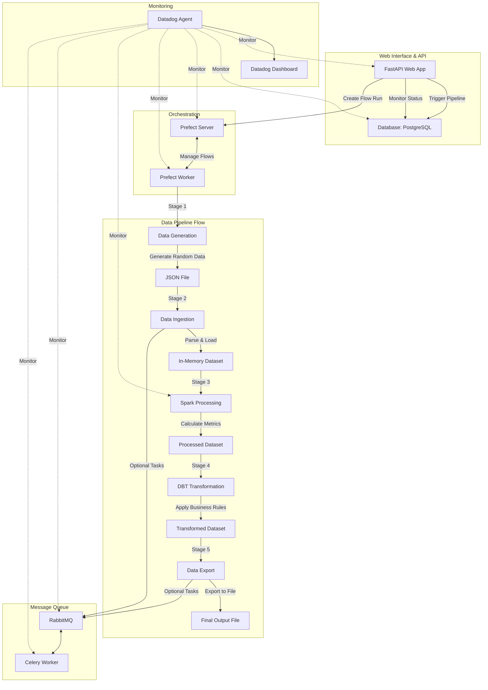

# README

---

title: Datadog Pipeline Demo Documentation
description: Comprehensive documentation for the Datadog Pipeline Demo project

---

# Datadog Pipeline Demo Documentation

Welcome to the documentation for the Datadog Pipeline Demo project! This documentation provides a comprehensive guide to understanding, using, and extending the data pipeline.

## 📋 Table of Contents

- [Architecture Overview](architecture.md)
- [Pipeline Stages](#pipeline-stages)
- [Technologies](#technologies)
- [Deployment Guides](#deployment-guides)
- [Tutorials and Exercises](#tutorials-and-exercises)

## 🔄 Pipeline Stages

Each stage of the pipeline is documented in detail:

1. [Data Generation](pipeline/stage1-generation.md) - Creating synthetic data
2. [Data Ingestion](pipeline/stage2-ingestion.md) - Loading and parsing data
3. [Spark Processing](pipeline/stage3-processing.md) - Distributed data processing
4. [DBT Transformation](pipeline/stage4-transformation.md) - Business rule application
5. [Data Export](pipeline/stage5-export.md) - Output preparation and storage

For a complete overview of how these stages work together, see the [Pipeline Overview](pipeline/overview.md).

## 🛠️ Technologies

Learn about each technology used in the pipeline:

- [FastAPI](technologies/fastapi.md) - Web framework and API
- [PostgreSQL](technologies/postgresql.md) - Relational database
- [Prefect](technologies/prefect.md) - Workflow orchestration
- [PySpark](technologies/spark.md) - Distributed computing
- [dbt](technologies/dbt.md) - Data transformation
- [RabbitMQ & Celery](technologies/rabbitmq-celery.md) - Message queue and task processing
- [Datadog](technologies/datadog.md) - Monitoring and observability

## 🚀 Deployment Guides

- [Local Deployment](deployments/local.md) - Run the pipeline on your local machine
- [Production Considerations](deployments/production.md) - Guidelines for production deployment

## 📚 Tutorials and Exercises

- [Extending the Pipeline](tutorials/extending.md) - Add new features and capabilities
- [Monitoring Setup](tutorials/monitoring.md) - Configure Datadog dashboards
- [Learning Exercises](tutorials/exercises.md) - Hands-on exercises for deeper understanding

## 🔍 Quick Start

<details>
<summary>Click to expand the quick start guide</summary>

1. Clone the repository:

   ```bash
   git clone <repository-url>
   cd datadog-demo
   ```

2. Start the application:

   ```bash
   docker-compose up -d
   ```

3. Access the web interface:

   ```
   http://localhost:8000
   ```

4. Run a data pipeline:

   - Navigate to the web interface
   - Click "Trigger New Pipeline" to start a data processing run
   - Watch the pipeline progress through the UI

5. Explore the component UIs:
   - **FastAPI UI**: http://localhost:8000
   - **Prefect UI**: http://localhost:4200
   - **RabbitMQ Management**: http://localhost:15672 (guest/guest)
   - **Spark Master UI**: http://localhost:8080
   </details>

## 📊 Pipeline Visualization



## 📝 Documentation Conventions

Throughout this documentation:

- Code examples are shown in syntax-highlighted blocks
- Command-line instructions use `$` as the prompt
- Environment variables are shown in `UPPERCASE`
- Configuration files and snippets are shown in their respective formats
- Technical terms are linked to their explanations on first use

## 🤝 Contributing to Documentation

We welcome contributions to improve this documentation! Please submit a pull request with your suggested changes.
