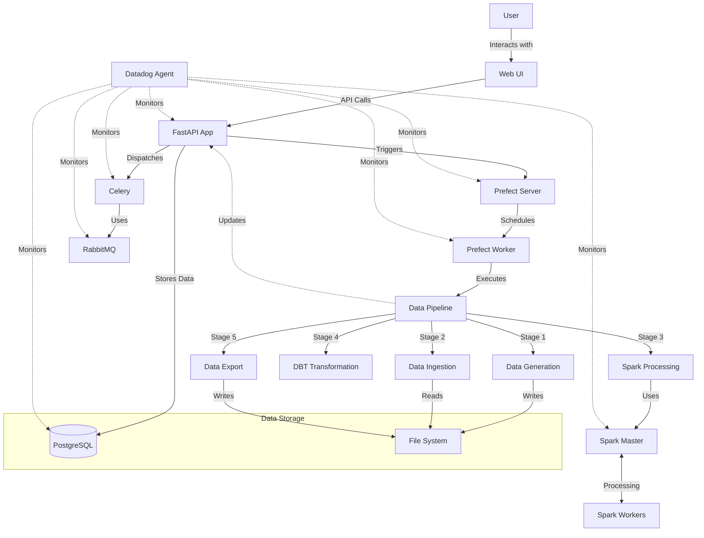
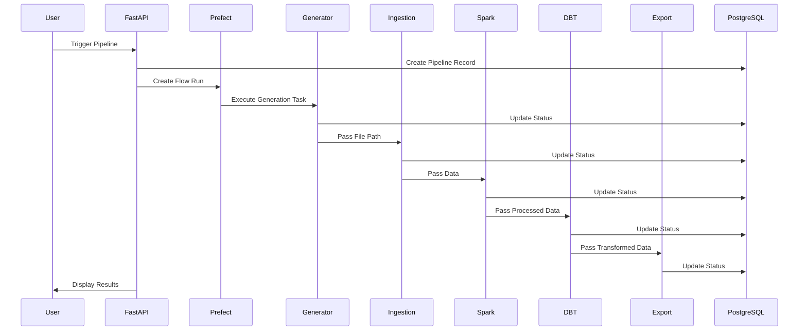

# Architecture Overview

This document explains the overall architecture of the Datadog Pipeline Demo, including the components, their interactions, and the design decisions.

## System Architecture

The system follows a modern microservices architecture with containerized components:



## Component Layers

The architecture consists of multiple logical layers:

### 1. User Interface Layer

- **FastAPI Web Application**: Provides a web interface and API endpoints
- **Templates**: HTML templates for the UI
- **Static Assets**: CSS, JavaScript, and images

### 2. Application Layer

- **FastAPI Routes**: API endpoints for triggering and monitoring pipelines
- **Database Models**: SQLAlchemy models for data persistence
- **Business Logic**: Pipeline management and control flow

### 3. Orchestration Layer

- **Prefect Server**: Flow scheduling and monitoring
- **Prefect Worker**: Flow execution environment
- **Celery**: Task queue for asynchronous processing
- **RabbitMQ**: Message broker for Celery tasks

### 4. Processing Layer

- **Pipeline Flows**: Prefect flows defining the pipeline
- **Pipeline Tasks**: Individual task implementations
- **Apache Spark**: Distributed data processing
- **dbt Core**: Data transformation framework

### 5. Storage Layer

- **PostgreSQL**: Relational database for metadata and pipeline state
- **File System**: Storage for input and output data files

### 6. Monitoring Layer

- **Datadog Agent**: Collection of metrics, traces, and logs
- **Datadog APM**: Application performance monitoring
- **Datadog Dashboards**: Visualization of pipeline metrics

## Communication Patterns

The system uses several communication patterns:

1. **Synchronous HTTP Communication**:

   - User to FastAPI Web UI
   - FastAPI to Prefect API
   - Internal API calls between components

2. **Asynchronous Messaging**:

   - Celery tasks through RabbitMQ
   - Event notifications

3. **File-based Communication**:

   - Data files passed between pipeline stages
   - Configuration files

4. **Database Access**:
   - Pipeline status tracking
   - Configuration storage
   - Result persistence

## Containerization

The entire application is containerized using Docker, with services defined in `docker-compose.yml`:

```yaml
services:
  # Database
  db:
    image: postgres:13
    # ...configuration...

  # RabbitMQ
  rabbitmq:
    image: rabbitmq:3-management
    # ...configuration...

  # Spark Master and Workers
  spark-master:
    image: bitnami/spark:3.3.0
    # ...configuration...

  spark-worker:
    image: bitnami/spark:3.3.0
    # ...configuration...

  # Prefect Server and Worker
  prefect-server:
    image: prefecthq/prefect:2-python3.9
    # ...configuration...

  prefect-worker:
    build: .
    # ...configuration...

  # Web Application
  webapp:
    build: .
    # ...configuration...

  # Celery Worker
  celery-worker:
    build: .
    # ...configuration...

  # Datadog Agent
  datadog-agent:
    image: gcr.io/datadoghq/agent:7
    # ...configuration...
```

## Data Flow

The data flows through the pipeline as follows:



## State Management

Pipeline state is tracked in the PostgreSQL database:

1. **Pipeline Entity**:

   - ID, name, description
   - Status (pending, running, completed, failed)
   - Timestamps (created, updated)
   - Input/output file paths
   - Records processed
   - Error messages

2. **Pipeline Stage Entity**:
   - Pipeline reference
   - Stage name and description
   - Status
   - Execution timing
   - Error messages

## Error Handling

The architecture implements multi-layered error handling:

1. **Task-level Error Handling**:

   - Try/except blocks in task implementations
   - Task retries configured in Prefect

2. **Flow-level Error Handling**:

   - Error propagation to the flow
   - Flow status updates

3. **Application-level Error Handling**:

   - API error responses
   - UI error displays
   - Database transaction management

4. **Infrastructure-level Error Handling**:
   - Container health checks
   - Container restart policies
   - Resource constraints management

## Monitoring & Observability

Monitoring is implemented using Datadog:

1. **Metrics Collection**:

   - Host-level metrics (CPU, memory, disk, network)
   - Container metrics
   - Application metrics
   - Custom business metrics

2. **Distributed Tracing**:

   - Request traces across services
   - Pipeline execution traces
   - Task execution traces

3. **Logging**:

   - Centralized log collection
   - Structured logging
   - Log correlation with traces

4. **Dashboards**:
   - Pipeline execution dashboard
   - Performance metrics
   - Error rates and types

## Scaling Considerations

While this demo runs locally, the architecture supports scaling:

<details>
<summary>Horizontal Scaling</summary>

- **Web Tier**: Multiple FastAPI instances behind a load balancer
- **Processing Tier**: Multiple Prefect workers and Spark workers
- **Database Tier**: Read replicas and connection pooling
- **Queue Tier**: RabbitMQ clustering
</details>

<details>
<summary>Vertical Scaling</summary>

- Increasing resources (CPU, memory) for compute-intensive containers
- Tuning database for larger datasets
- Optimizing JVM settings for Spark
</details>

<details>
<summary>Data Volume Scaling</summary>

- Partitioning strategies for larger datasets
- Incremental processing
- Checkpointing for long-running pipelines
- Storage optimization
</details>

## Security Considerations

The demo implements basic security measures:

1. **Authentication**: Basic authentication for service UIs
2. **Network Isolation**: Container networking
3. **Secrets Management**: Environment variables for credentials
4. **Least Privilege**: Minimal container permissions

In a production environment, additional security measures would be recommended:

<details>
<summary>Enhanced Security Recommendations</summary>

- **Network Security**: Network policies, TLS everywhere
- **Authentication**: OAuth/OIDC integration
- **Authorization**: Role-based access control
- **Secrets**: External secrets management
- **Compliance**: Audit logging and compliance controls
</details>

## Design Decisions

Several key design decisions shaped this architecture:

1. **Microservices Approach**: Enables independent scaling and technology selection
2. **Containerization**: Provides consistent environments and deployment
3. **Event-Driven Design**: Facilitates asynchronous processing and loose coupling
4. **Comprehensive Monitoring**: Ensures observability across the stack
5. **Modular Pipeline**: Allows for flexible extension and modification

## Technology Selection Rationale

| Component      | Technology | Rationale                                     |
| -------------- | ---------- | --------------------------------------------- |
| Web Framework  | FastAPI    | Performance, ease of use, async support       |
| Database       | PostgreSQL | Reliability, feature set, community support   |
| Workflow       | Prefect    | Modern features, Python-native, observability |
| Processing     | PySpark    | Scalable processing, Python integration       |
| Transformation | dbt        | SQL-first, modularity, testing capabilities   |
| Messaging      | RabbitMQ   | Reliability, feature set, community support   |
| Task Queue     | Celery     | Python integration, scalability, flexibility  |
| Monitoring     | Datadog    | Comprehensive monitoring, APM, dashboarding   |

## Development Workflow

The project supports a streamlined development workflow:

1. **Local Development**: Running services locally with docker-compose
2. **Testing**: Unit and integration testing support
3. **CI/CD**: Support for continuous integration pipelines
4. **Deployment**: Containerized deployment to any environment

## Next Steps

With this architectural understanding, you can dive deeper into:

- [Pipeline Overview](pipeline/overview.md) - How the data flows through the system
- [Technology Deep Dives](docs/technologies/) - Detailed explanations of each technology
- [Deployment Guide](deployments/local.md) - How to run the system
