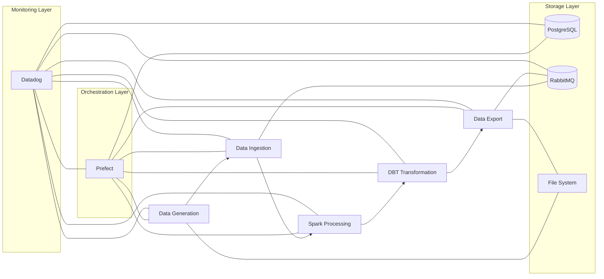
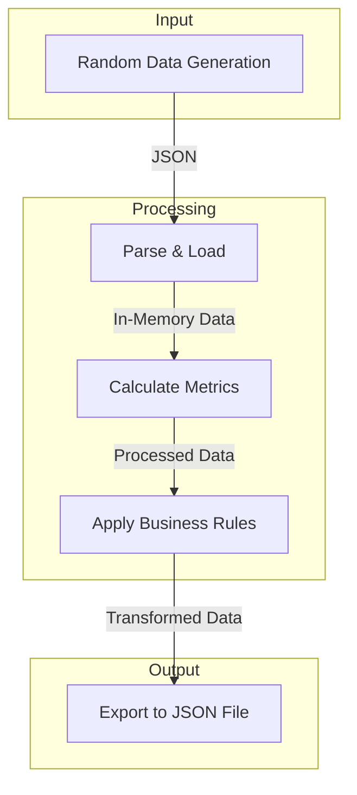

# Pipeline Overview

This document provides a high-level overview of the entire data pipeline, explaining how all components work together to process data.

## Pipeline Architecture

The data pipeline follows a modern architecture with distinct stages, orchestrated by Prefect and monitored by Datadog:

## Pipeline Flow in Detail

1. **Web Interface Triggers Pipeline**

   - User clicks "Trigger Pipeline" in the FastAPI web interface
   - FastAPI creates a pipeline record in PostgreSQL
   - FastAPI triggers a Prefect flow run

2. **Prefect Orchestrates Execution**

   - Prefect worker picks up the flow run
   - Prefect executes each task in sequence
   - Prefect tracks state and handles any failures

3. **Data Flows Through Stages**

   - Stage 1: Generate random structured data and save to JSON file
   - Stage 2: Read and parse the JSON file
   - Stage 3: Process data with PySpark to calculate metrics
   - Stage 4: Apply business rules using dbt transformations
   - Stage 5: Export final data to output files

4. **Status Updates Throughout**
   - Each stage updates the pipeline status in PostgreSQL
   - Web interface shows real-time updates to the user
   - Logs and metrics are sent to Datadog

## Data Flow Visualization

The following diagram shows how data flows through the pipeline:

## Pipeline Stages at a Glance

| Stage              | Primary Technology | Input               | Output              | Key Operations                          |
| ------------------ | ------------------ | ------------------- | ------------------- | --------------------------------------- |
| Data Generation    | Python, Faker      | Configuration       | JSON File           | Generate structured random data         |
| Data Ingestion     | Python JSON Parser | JSON File           | In-Memory Dataset   | Parse, validate, and prepare data       |
| Spark Processing   | PySpark            | In-Memory Dataset   | Processed Dataset   | Calculate metrics and aggregations      |
| DBT Transformation | dbt / Python       | Processed Dataset   | Transformed Dataset | Apply business rules and categorization |
| Data Export        | Python JSON        | Transformed Dataset | Output File         | Format and save final data              |

## Key Performance Indicators

The pipeline tracks several key metrics:

- **Total processing time**: End-to-end pipeline execution time
- **Records processed**: Number of data records processed
- **Stage execution times**: Time spent in each stage
- **Success rate**: Percentage of successful pipeline runs
- **Error count**: Number of errors encountered

## Theoretical vs. Practical Capacity

While this demo is designed to run on a local machine with modest data volumes, the architecture could scale to handle much larger datasets:

Scaling characteristics

| Component        | Demo Capacity              | Theoretical Maximum                    |
| ---------------- | -------------------------- | -------------------------------------- |
| Data Generation  | 1,000-10,000 records       | Millions (with distributed generation) |
| Spark Processing | Local mode processing      | Cluster mode with many worker nodes    |
| Database         | Single PostgreSQL instance | Replicated, sharded database           |
| Message Queue    | Single RabbitMQ node       | Clustered RabbitMQ                     |
| Workers          | Single Celery worker       | Multiple workers across machines       |

## Key Files and Components

- `app/pipeline/flows.py`: Defines the Prefect flow and tasks
- `app/db/models.py`: Defines the database models for tracking
- `app/api/routes.py`: API endpoints for triggering and monitoring
- `app/templates/`: Web interface templates
- `docker-compose.yml`: Container setup for all components

## Failure Handling

The pipeline includes several mechanisms for handling failures:

- Prefect task retries for transient errors
- Error capture and reporting to the database
- Comprehensive logging for troubleshooting
- Pipeline state tracking for manual intervention

## Next Steps

To understand each stage in detail, explore the individual stage documentation:

1. [Data Generation](stage1-generation.md)
2. [Data Ingestion](stage2-ingestion.md)
3. [Spark Processing](stage3-processing.md)
4. [DBT Transformation](stage4-transformation.md)
5. [Data Export](stage5-export.md)
