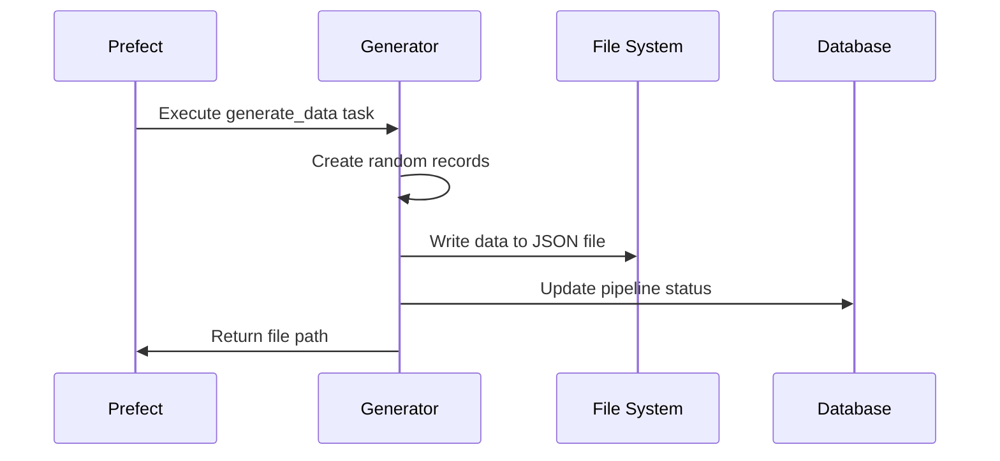

# Stage 1: Data Generation

This document explains the data generation stage of the pipeline, which creates synthetic data for processing.

## Purpose

The data generation stage serves several key purposes:

1. **Create synthetic data** that simulates real-world business data
2. **Provide consistent test data** for pipeline development and demonstrations
3. **Control data characteristics** to highlight specific processing features
4. **Generate a variable number of records** to test performance

## Technology Used

- **Python** as the core programming language
- **Prefect @task decorator** to define the task within the flow
- **Random and Datetime libraries** for data generation
- **JSON module** for structured data serialization

## Process Flow



## Implementation Details

### Task Definition

The data generation task is defined as a Prefect task:

```python
@task(name="generate_data", retries=2)
async def generate_data(pipeline_id: int, records: int = 1000) -> str:
    """
    Generate a sample dataset for processing

    Args:
        pipeline_id: ID of the pipeline to update
        records: Number of records to generate

    Returns:
        Path to the generated data file
    """
    # Task implementation...
```

### Data Structure

Each generated record contains the following fields:

| Field      | Type         | Description       | Example                    |
| ---------- | ------------ | ----------------- | -------------------------- |
| id         | integer      | Unique identifier | 42                         |
| name       | string       | Item name         | "Item 42"                  |
| category   | string       | Category (A-D)    | "B"                        |
| value      | float        | Monetary value    | 127.54                     |
| quantity   | integer      | Item count        | 5                          |
| is_active  | boolean      | Status flag       | true                       |
| created_at | string (ISO) | Timestamp         | "2023-04-15T08:30:00.000Z" |

### Generation Algorithm

<details>
<summary>Expand to see the data generation algorithm details</summary>

1. Create an empty list to hold the records
2. For each record (up to the requested count):
   - Generate a unique ID (sequential)
   - Create a name based on the ID
   - Randomly select a category from A, B, C, or D
   - Generate a random value between 10 and 1000
   - Generate a random quantity between 1 and 100
   - Randomly set is_active to true or false
   - Generate a random creation date within the past 30 days
   - Add the record to the list
3. Serialize the list to JSON format
4. Save to a file with a timestamp-based name
</details>

### Full Implementation

```python
async def generate_data(pipeline_id: int, records: int = 1000) -> str:
    """
    Generate a sample dataset for processing
    """
    logger = get_run_logger()
    logger.info(f"Generating {records} records of sample data")

    await update_pipeline_status(
        pipeline_id=pipeline_id,
        stage_name="Data Generation",
        status="running"
    )

    try:
        # Create data directory if it doesn't exist
        data_dir = "/app/data/input"
        os.makedirs(data_dir, exist_ok=True)

        # Generate filename based on timestamp
        timestamp = datetime.datetime.now().strftime("%Y%m%d_%H%M%S")
        filename = f"sample_data_{timestamp}.json"
        filepath = os.path.join(data_dir, filename)

        # Generate random data
        data = []
        for i in range(records):
            data.append({
                "id": i,
                "name": f"Item {i}",
                "category": random.choice(["A", "B", "C", "D"]),
                "value": round(random.uniform(10, 1000), 2),
                "quantity": random.randint(1, 100),
                "is_active": random.choice([True, False]),
                "created_at": (
                    datetime.datetime.now() -
                    datetime.timedelta(days=random.randint(0, 30))
                ).isoformat()
            })

        # Write data to file
        with open(filepath, 'w') as f:
            json.dump(data, f, indent=2)

        logger.info(f"Generated data file: {filepath}")

        await update_pipeline_status(
            pipeline_id=pipeline_id,
            stage_name="Data Generation",
            status="completed",
            message=f"Generated {records} records to {filename}"
        )

        return filepath

    except Exception as e:
        logger.error(f"Error generating data: {e}")
        await update_pipeline_status(
            pipeline_id=pipeline_id,
            stage_name="Data Generation",
            status="failed",
            message=f"Error generating data: {str(e)}"
        )
        raise
```

## Example Output

A snippet of the generated JSON file:

```json
[
  {
    "id": 0,
    "name": "Item 0",
    "category": "B",
    "value": 432.17,
    "quantity": 23,
    "is_active": true,
    "created_at": "2023-04-12T14:35:22.345678"
  },
  {
    "id": 1,
    "name": "Item 1",
    "category": "A",
    "value": 127.54,
    "quantity": 5,
    "is_active": false,
    "created_at": "2023-04-02T09:12:45.123456"
  },
  ...
]
```

## Configuration Options

The data generation stage accepts the following configuration options:

| Parameter   | Default    | Description                   |
| ----------- | ---------- | ----------------------------- |
| records     | 1000       | Number of records to generate |
| pipeline_id | _required_ | ID of the pipeline to update  |

## Error Handling

The generator task includes several error handling mechanisms:

- **Try/except block** to catch and report any errors
- **Prefect retries** (up to 2 retries) for transient issues
- **Status updates** to record failures in the database
- **Directory creation** with `exist_ok=True` to prevent race conditions

## Performance Characteristics

| Records | Approximate Time | File Size |
| ------- | ---------------- | --------- |
| 100     | < 1 second       | 15 KB     |
| 1,000   | 1-2 seconds      | 150 KB    |
| 10,000  | 5-10 seconds     | 1.5 MB    |
| 100,000 | 45-60 seconds    | 15 MB     |

## Optimization Opportunities

<details>
<summary>Click to see potential optimizations</summary>

1. **Parallel generation**: Split the generation across multiple processes
2. **Streaming output**: Write records as they're generated instead of all at once
3. **Faker library**: Use the Faker library for more realistic data
4. **Custom schemas**: Allow configurable data schemas beyond the fixed structure
5. **Data variety**: Introduce variability and edge cases in the generated data
</details>

## Integration Points

- **Input**: Configuration parameters from the pipeline flow
- **Output**: JSON file path passed to the data ingestion stage
- **Status Updates**: Pipeline status updated in PostgreSQL
- **Monitoring**: Logs and execution metrics sent to Datadog

## Testing

To test the data generation stage in isolation:

```python
from app.pipeline.flows import generate_data
import asyncio

# Create a test pipeline record first, then:
result = asyncio.run(generate_data(pipeline_id=1, records=100))
print(f"Generated file: {result}")
```

## Next Stage

After data generation, the pipeline proceeds to [Stage 2: Data Ingestion](stage2-ingestion.md).
