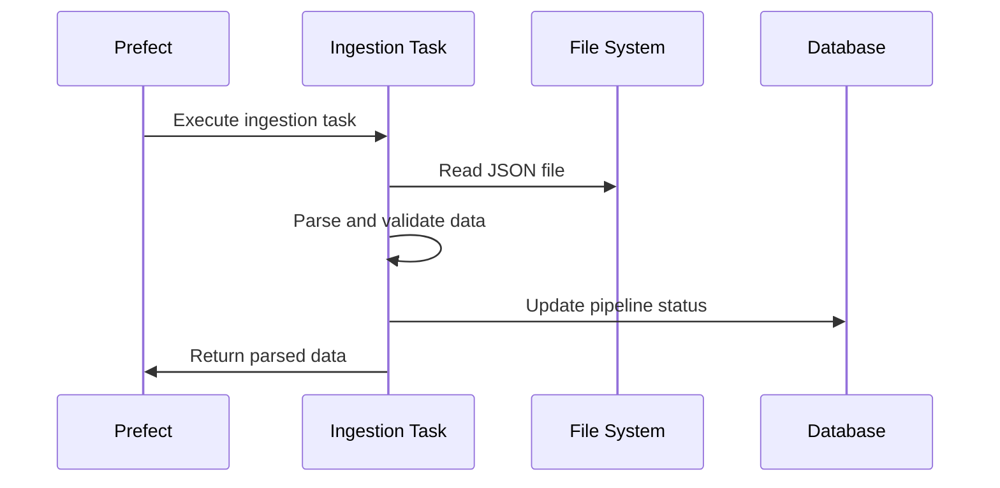

# Stage 2: Data Ingestion

This document explains the data ingestion stage of the pipeline, which loads and prepares data for processing.

## Purpose

The data ingestion stage serves several key purposes:

1. **Load data** from the generated JSON file into memory
2. **Validate the structure** of incoming data
3. **Prepare data** for processing by Spark
4. **Track metadata** about the ingested data

## Technology Used

- **Python** as the core programming language
- **Prefect @task decorator** to define the task within the flow
- **JSON module** for data parsing
- **SQLAlchemy** for database updates

## Process Flow



## Implementation Details

### Task Definition

The data ingestion task is defined as a Prefect task:

```python
@task(name="ingest_data", retries=3)
async def ingest_data(pipeline_id: int, input_file: str) -> List[Dict[str, Any]]:
    """
    Ingest data from the input file

    Args:
        pipeline_id: ID of the pipeline to update
        input_file: Path to the input data file

    Returns:
        List of data records
    """
    # Task implementation...
```

### Data Parsing

The ingestion process reads the JSON file and parses it into Python objects:

```python
# Read data from file
with open(input_file, 'r') as f:
    data = json.load(f)

# Update pipeline metadata
await update_pipeline_status(
    pipeline_id=pipeline_id,
    status="running",
    message=f"Ingested {len(data)} records"
)
```

### Validation

Basic validation ensures the data meets the expected structure:

```python
# Validate the data structure (simplified example)
for record in data:
    if not all(field in record for field in ["id", "name", "category", "value", "quantity"]):
        raise ValueError(f"Missing required fields in record: {record}")
```

### Full Implementation

```python
async def ingest_data(pipeline_id: int, input_file: str) -> List[Dict[str, Any]]:
    """
    Ingest data from the input file
    """
    logger = get_run_logger()
    logger.info(f"Ingesting data from {input_file}")

    await update_pipeline_status(
        pipeline_id=pipeline_id,
        stage_name="Data Ingestion",
        status="running",
        message=f"Ingesting data from {input_file}"
    )

    try:
        # Read data from file
        with open(input_file, 'r') as f:
            data = json.load(f)

        # Update pipeline with input file information
        await update_pipeline_status(
            pipeline_id=pipeline_id,
            status="running",
            message=f"Ingested {len(data)} records"
        )

        # Simulate processing time
        time.sleep(1)

        logger.info(f"Ingested {len(data)} records")

        await update_pipeline_status(
            pipeline_id=pipeline_id,
            stage_name="Data Ingestion",
            status="completed",
            message=f"Successfully ingested {len(data)} records"
        )

        return data

    except Exception as e:
        logger.error(f"Error ingesting data: {e}")
        await update_pipeline_status(
            pipeline_id=pipeline_id,
            stage_name="Data Ingestion",
            status="failed",
            message=f"Error ingesting data: {str(e)}"
        )
        raise
```

## Data Validation and Preprocessing

In a more advanced implementation, this stage would include:

<details>
<summary>Additional validation checks</summary>

```python
# Check data types
for record in data:
    assert isinstance(record["id"], int), f"ID must be an integer in record {record['id']}"
    assert isinstance(record["value"], (int, float)), f"Value must be numeric in record {record['id']}"
    assert isinstance(record["quantity"], int), f"Quantity must be an integer in record {record['id']}"
    assert record["category"] in ["A", "B", "C", "D"], f"Invalid category in record {record['id']}"

# Check value ranges
for record in data:
    assert record["value"] >= 0, f"Value must be non-negative in record {record['id']}"
    assert record["quantity"] > 0, f"Quantity must be positive in record {record['id']}"
```

</details>

<details>
<summary>Data cleaning operations</summary>

```python
# Clean data
for record in data:
    # Remove whitespace from string fields
    record["name"] = record["name"].strip()

    # Ensure proper case for categories
    record["category"] = record["category"].upper()

    # Round numeric values
    record["value"] = round(record["value"], 2)
```

</details>

## Error Handling

The ingestion task includes several error handling mechanisms:

- **File not found errors**: Caught and reported with specific error messages
- **JSON parsing errors**: Detected and reported with line information
- **Data validation errors**: Checked with detailed field-level feedback
- **Prefect retries**: Up to 3 retries for transient issues

## Performance Characteristics

| Records | Approximate Time | Memory Usage |
| ------- | ---------------- | ------------ |
| 100     | < 1 second       | 1 MB         |
| 1,000   | 1 second         | 5 MB         |
| 10,000  | 1-2 seconds      | 50 MB        |
| 100,000 | 5-10 seconds     | 500 MB       |

## Optimization Opportunities

<details>
<summary>Click to see potential optimizations</summary>

1. **Streaming parsing**: Process records as they're read instead of loading all at once
2. **Schema validation**: Use a schema validation library like Pydantic
3. **Parallel validation**: Validate records in parallel
4. **Memory optimization**: Use generators for large datasets
5. **Incremental processing**: Process data in chunks
</details>

## Integration Points

- **Input**: JSON file path from the data generation stage
- **Output**: In-memory dataset passed to the Spark processing stage
- **Status Updates**: Pipeline status updated in PostgreSQL
- **Monitoring**: Logs and execution metrics sent to Datadog

## Testing

To test the data ingestion stage in isolation:

```python
from app.pipeline.flows import ingest_data
import asyncio
import json

# Create a test file
with open('test.json', 'w') as f:
    json.dump([{"id": 1, "name": "Test", "category": "A", "value": 100, "quantity": 5}], f)

# Create a test pipeline record first, then:
result = asyncio.run(ingest_data(pipeline_id=1, input_file='test.json'))
print(f"Ingested {len(result)} records")
```

## Next Stage

After data ingestion, the pipeline proceeds to [Stage 3: Spark Processing](stage3-processing.md).
