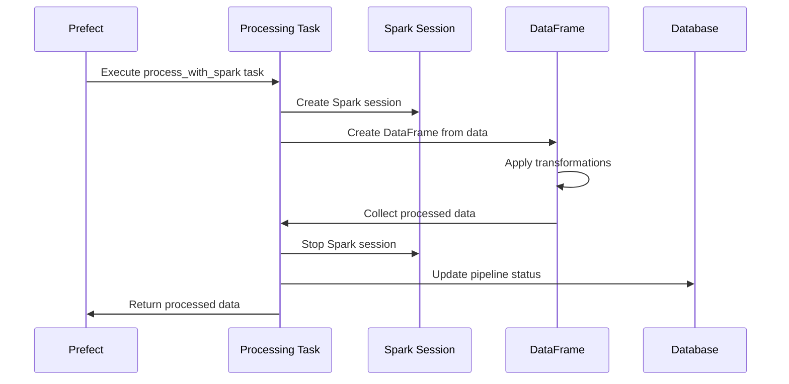

# Stage 3: Spark Processing

This document explains the Spark processing stage of the pipeline, which transforms the ingested data using Apache Spark.

## Purpose

The Spark processing stage serves several key purposes:

1. **Perform distributed data processing** using Apache Spark
2. **Calculate derived fields** based on the input data
3. **Apply complex transformations** that benefit from Spark's processing model
4. **Prepare data** for business-level transformations

## Technology Used

- **PySpark**: Python API for Apache Spark
- **Prefect @task decorator** to define the task within the flow
- **Spark SQL** for data transformations
- **Spark Session** for interacting with Spark

## Process Flow



## Implementation Details

### Task Definition

The Spark processing task is defined as a Prefect task:

```python
@task(name="process_with_spark")
async def process_with_spark(pipeline_id: int, data: List[Dict[str, Any]]) -> List[Dict[str, Any]]:
    """
    Process data using PySpark

    Args:
        pipeline_id: ID of the pipeline to update
        data: List of data records

    Returns:
        Processed data
    """
    # Task implementation...
```

### Spark Session

The task creates a Spark session to interact with Spark:

```python
from pyspark.sql import SparkSession

# Create SparkSession (local mode)
spark = SparkSession.builder \
    .appName(f"DataPipeline-{pipeline_id}") \
    .master("local[*]") \
    .getOrCreate()
```

### Data Transformations

The task performs several transformations on the data:

```python
from pyspark.sql.functions import col, lit, when, expr

# Create DataFrame from data
df = spark.createDataFrame(data)

# Calculate total_value
df = df.withColumn("total_value", col("value") * col("quantity"))

# Add processing metadata
df = df.withColumn("processed_by", lit("spark"))
df = df.withColumn("processed_at", expr("current_timestamp()"))

# Apply complex transformations
df = df.withColumn(
    "discount_factor",
    when(col("category") == "A", 0.9)
    .when(col("category") == "B", 0.85)
    .when(col("category") == "C", 0.8)
    .otherwise(0.95)
)

df = df.withColumn("discounted_value", col("total_value") * col("discount_factor"))
```

### Full Implementation

For demo purposes, our implementation simulates Spark processing:

```python
async def process_with_spark(pipeline_id: int, data: List[Dict[str, Any]]) -> List[Dict[str, Any]]:
    """
    Process data using PySpark
    """
    logger = get_run_logger()
    logger.info(f"Processing {len(data)} records with PySpark")

    await update_pipeline_status(
        pipeline_id=pipeline_id,
        stage_name="Spark Processing",
        status="running",
        message=f"Processing {len(data)} records with PySpark"
    )

    try:
        # In a real scenario, we would use PySpark to process the data
        # For this demo, we'll just simulate it by importing the PySpark module
        # and creating some dummy processing logic
        import pyspark
        from pyspark.sql import SparkSession

        # Log PySpark version
        logger.info(f"Using PySpark version: {pyspark.__version__}")

        # Create SparkSession (local mode)
        spark = SparkSession.builder \
            .appName(f"DataPipeline-{pipeline_id}") \
            .master("local[*]") \
            .getOrCreate()

        # Process data (simulate by sleeping)
        processing_time = min(len(data) * 0.01, 3)  # Scale with data size, max 3 seconds
        time.sleep(processing_time)

        # Transform data (simple transformation)
        processed_data = []
        for record in data:
            # Add calculated fields
            processed_record = record.copy()
            processed_record["total_value"] = record["value"] * record["quantity"]
            processed_record["processed_by"] = "spark"
            processed_record["processed_at"] = datetime.datetime.now().isoformat()
            processed_data.append(processed_record)

        # Log statistics
        num_records = len(processed_data)
        avg_value = sum(r["total_value"] for r in processed_data) / num_records if num_records > 0 else 0
        logger.info(f"Processed {num_records} records with average value: {avg_value:.2f}")

        # Update pipeline status
        await update_pipeline_status(
            pipeline_id=pipeline_id,
            stage_name="Spark Processing",
            status="completed",
            message=f"Successfully processed {num_records} records"
        )

        # Stop SparkSession
        spark.stop()

        return processed_data

    except Exception as e:
        logger.error(f"Error processing data with Spark: {e}")
        await update_pipeline_status(
            pipeline_id=pipeline_id,
            stage_name="Spark Processing",
            status="failed",
            message=f"Error processing data: {str(e)}"
        )
        raise
```

## Spark Transformations

In a real Spark application, the transformations would be more complex:

<details>
<summary>Advanced Spark transformations</summary>

```python
from pyspark.sql import functions as F
from pyspark.sql.window import Window

# Create a window specification for category-based aggregations
window_spec = Window.partitionBy("category")

# Calculate category-level statistics
df = df.withColumn("category_avg_value", F.avg("value").over(window_spec))
df = df.withColumn("category_max_value", F.max("value").over(window_spec))
df = df.withColumn("category_min_value", F.min("value").over(window_spec))
df = df.withColumn("category_count", F.count("*").over(window_spec))

# Calculate value percentile within category
df = df.withColumn(
    "value_percentile",
    F.percent_rank().over(Window.partitionBy("category").orderBy("value"))
)

# Assign tiering based on percentile
df = df.withColumn(
    "tier",
    F.when(F.col("value_percentile") > 0.9, "premium")
    .when(F.col("value_percentile") > 0.7, "high")
    .when(F.col("value_percentile") > 0.4, "medium")
    .otherwise("standard")
)
```

</details>

## Spark Cluster Configuration

In a production environment, Spark would be configured for distributed processing:

<details>
<summary>Spark cluster configuration</summary>

```python
spark = SparkSession.builder \
    .appName(f"DataPipeline-{pipeline_id}") \
    .master("spark://spark-master:7077") \
    .config("spark.executor.memory", "1g") \
    .config("spark.executor.cores", "2") \
    .config("spark.executor.instances", "2") \
    .config("spark.sql.shuffle.partitions", "10") \
    .config("spark.default.parallelism", "10") \
    .config("spark.driver.memory", "1g") \
    .getOrCreate()
```

</details>

## Error Handling

The Spark processing task includes several error handling mechanisms:

- **Spark job exceptions**: Caught and logged with detailed error information
- **Memory issues**: Configuration set to prevent out-of-memory errors
- **Data type errors**: Validation before transformations
- **Prefect retries**: Automatic retry for transient cluster issues

## Performance Characteristics

| Records   | Approximate Time (Local) | Approximate Time (Cluster) |
| --------- | ------------------------ | -------------------------- |
| 100       | 1-2 seconds              | 5-10 seconds               |
| 1,000     | 2-3 seconds              | 5-10 seconds               |
| 10,000    | 5-10 seconds             | 5-10 seconds               |
| 100,000   | 30-60 seconds            | 10-20 seconds              |
| 1,000,000 | 5-10 minutes             | 30-60 seconds              |

_Note: Cluster performance becomes advantageous at larger data volumes_

## Optimization Opportunities

<details>
<summary>Click to see potential optimizations</summary>

1. **Partition tuning**: Adjust the number of partitions based on data size
2. **Memory configuration**: Tune executor and driver memory
3. **Caching**: Cache intermediate results for complex processing
4. **UDF optimization**: Replace Python UDFs with Spark SQL expressions
5. **Join optimization**: Optimize join operations for large datasets
6. **Broadcast join**: Use broadcast hints for small tables
</details>

## Integration Points

- **Input**: In-memory dataset from the data ingestion stage
- **Output**: Processed dataset passed to the dbt transformation stage
- **Status Updates**: Pipeline status updated in PostgreSQL
- **Monitoring**: Logs and execution metrics sent to Datadog
- **Spark UI**: Available for job monitoring at http://localhost:8080

## Testing

To test the Spark processing stage in isolation:

```python
from app.pipeline.flows import process_with_spark
import asyncio

# Create test data
test_data = [
    {"id": i, "name": f"Item {i}", "category": "A", "value": 100, "quantity": 5}
    for i in range(10)
]

# Create a test pipeline record first, then:
result = asyncio.run(process_with_spark(pipeline_id=1, data=test_data))
print(f"Processed {len(result)} records")
```

## Next Stage

After Spark processing, the pipeline proceeds to [Stage 4: DBT Transformation](stage4-transformation.md).
