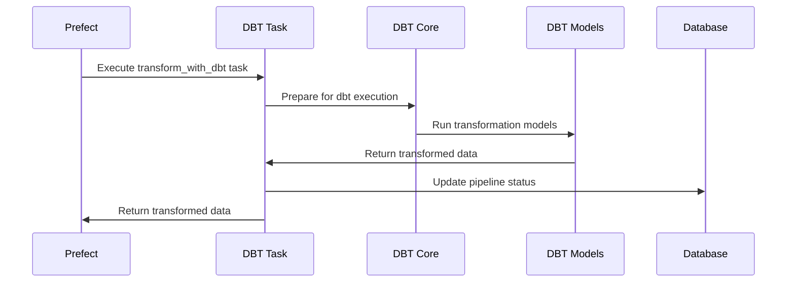

# Stage 4: DBT Transformation

This document explains the dbt (data build tool) transformation stage of the pipeline, which applies business logic and rules to the processed data.

## Purpose

The dbt transformation stage serves several key purposes:

1. **Apply business rules** to the processed data
2. **Create analytics-ready data models** based on business requirements
3. **Calculate business metrics** and derived fields
4. **Categorize and segment** data according to business logic
5. **Ensure data consistency** through defined transformations

## Technology Used

- **dbt-core**: Data build tool for transformations
- **Prefect @task decorator** to define the task within the flow
- **SQL**: The primary language for dbt transformations
- **Jinja2**: Template engine used by dbt for SQL generation

## Process Flow



## Implementation Details

### Task Definition

The dbt transformation task is defined as a Prefect task:

```python
@task(name="transform_with_dbt")
async def transform_with_dbt(pipeline_id: int, data: List[Dict[str, Any]]) -> List[Dict[str, Any]]:
    """
    Transform data using dbt

    Args:
        pipeline_id: ID of the pipeline to update
        data: List of processed data records

    Returns:
        Transformed data
    """
    # Task implementation...
```

### DBT Models

In a typical dbt project, models would be defined as SQL files:

```sql
-- models/marts/item_metrics.sql
WITH item_data AS (
    SELECT
        item_id,
        item_name,
        category,
        item_value,
        item_quantity,
        item_value * item_quantity AS total_value,
        item_value * item_quantity * discount_factor AS discounted_value,
        is_active,
        created_at,
        processed_at
    FROM {{ ref('stg_items') }}
)

SELECT
    item_id,
    item_name,
    category,
    item_value,
    item_quantity,
    total_value,
    discounted_value,
    is_active,
    CASE
        WHEN total_value > 5000 THEN 'premium'
        WHEN total_value > 1000 THEN 'standard'
        ELSE 'basic'
    END AS pricing_tier,
    created_at,
    processed_at,
    CURRENT_TIMESTAMP AS transformed_at
FROM item_data
```

### Full Implementation

For demo purposes, our implementation simulates dbt processing:

```python
async def transform_with_dbt(pipeline_id: int, data: List[Dict[str, Any]]) -> List[Dict[str, Any]]:
    """
    Transform data using dbt
    """
    logger = get_run_logger()
    logger.info(f"Transforming data with dbt")

    await update_pipeline_status(
        pipeline_id=pipeline_id,
        stage_name="DBT Transformation",
        status="running",
        message=f"Transforming data with dbt-core"
    )

    try:
        # In a real scenario, we would use dbt to transform data in the database
        # For this demo, we'll simulate the process

        # Simulate dbt processing time
        time.sleep(2)

        # Simulate dbt transformations
        transformed_data = []
        categories = {}

        for record in data:
            # Group by category for aggregation
            category = record["category"]
            if category not in categories:
                categories[category] = []
            categories[category].append(record)

            # Apply transformations to individual records
            transformed_record = record.copy()
            transformed_record["is_high_value"] = record["total_value"] > 5000
            transformed_record["tier"] = (
                "premium" if record["total_value"] > 5000
                else "standard" if record["total_value"] > 1000
                else "basic"
            )
            transformed_record["transformed_by"] = "dbt"
            transformed_record["transformed_at"] = datetime.datetime.now().isoformat()
            transformed_data.append(transformed_record)

        # Add category aggregates
        for category, records in categories.items():
            avg_value = sum(r["total_value"] for r in records) / len(records)
            for record in transformed_data:
                if record["category"] == category:
                    record["category_avg_value"] = avg_value

        # Log statistics
        logger.info(f"Transformed {len(transformed_data)} records across {len(categories)} categories")

        await update_pipeline_status(
            pipeline_id=pipeline_id,
            stage_name="DBT Transformation",
            status="completed",
            message=f"Successfully transformed {len(transformed_data)} records"
        )

        return transformed_data

    except Exception as e:
        logger.error(f"Error transforming data with dbt: {e}")
        await update_pipeline_status(
            pipeline_id=pipeline_id,
            stage_name="DBT Transformation",
            status="failed",
            message=f"Error transforming data: {str(e)}"
        )
        raise
```

## DBT Project Structure

In a real dbt project, the structure would look like:

<details>
<summary>DBT project structure</summary>

```
dbt_project/
├── dbt_project.yml    # Project configuration
├── profiles.yml       # Connection profiles
├── models/            # Data models
│   ├── staging/       # Initial transformations
│   │   └── stg_items.sql
│   ├── marts/         # Business-oriented models
│   │   └── item_metrics.sql
│   └── schema.yml     # Schema definitions
├── macros/            # Reusable SQL macros
├── seeds/             # Static data files
└── snapshots/         # Point-in-time models
```

</details>

## Example Business Rules

The transformation stage applies various business rules:

<details>
<summary>Pricing tier rules</summary>

```sql
-- Define pricing tiers based on total value
CASE
    WHEN total_value > 5000 THEN 'premium'
    WHEN total_value > 1000 THEN 'standard'
    ELSE 'basic'
END AS pricing_tier
```

</details>

<details>
<summary>Discount calculation rules</summary>

```sql
-- Apply category-specific discounts
CASE
    WHEN category = 'A' THEN 0.9  -- 10% discount
    WHEN category = 'B' THEN 0.85 -- 15% discount
    WHEN category = 'C' THEN 0.8  -- 20% discount
    ELSE 0.95                     -- 5% discount
END AS discount_factor
```

</details>

<details>
<summary>Status determination rules</summary>

```sql
-- Determine item status based on multiple factors
CASE
    WHEN is_active = FALSE THEN 'inactive'
    WHEN quantity = 0 THEN 'out_of_stock'
    WHEN quantity < 10 THEN 'low_stock'
    ELSE 'available'
END AS stock_status
```

</details>

## Transformation Output

The transformation stage adds several business-oriented fields:

| Field              | Description                   | Example                    |
| ------------------ | ----------------------------- | -------------------------- |
| is_high_value      | Flag for high-value items     | true                       |
| tier               | Pricing tier based on value   | "premium"                  |
| category_avg_value | Average value in the category | 2541.23                    |
| discount_factor    | Category-specific discount    | 0.9                        |
| discounted_value   | Value after discount          | 1800.00                    |
| transformed_by     | Transformation tool           | "dbt"                      |
| transformed_at     | Transformation timestamp      | "2023-04-15T10:30:00.000Z" |

## Error Handling

The dbt transformation task includes several error handling mechanisms:

- **SQL errors**: Caught and reported with context
- **Model dependencies**: Managed by dbt's dependency resolution
- **Test failures**: dbt tests for data quality
- **Prefect error handling**: Exception capture and reporting

## Performance Characteristics

| Records | Approximate Time |
| ------- | ---------------- |
| 100     | 2-3 seconds      |
| 1,000   | 3-5 seconds      |
| 10,000  | 5-10 seconds     |
| 100,000 | 20-40 seconds    |

## Optimization Opportunities

<details>
<summary>Click to see potential optimizations</summary>

1. **Incremental models**: Use dbt's incremental materialization for large datasets
2. **Materialization strategy**: Choose appropriate materializations (view, table, ephemeral)
3. **Indexing strategy**: Define proper indexes for transformed tables
4. **Query optimization**: Optimize SQL queries in models
5. **Partitioning**: Use table partitioning for large tables
</details>

## Integration Points

- **Input**: Processed dataset from the Spark processing stage
- **Output**: Transformed dataset passed to the data export stage
- **Status Updates**: Pipeline status updated in PostgreSQL
- **Monitoring**: Logs and execution metrics sent to Datadog

## Testing with DBT

In a real dbt project, tests would be defined in the schema.yml file:

<details>
<summary>dbt tests example</summary>

```yaml
version: 2

models:
  - name: item_metrics
    description: "Item metrics for business analysis"
    columns:
      - name: item_id
        description: "Unique identifier for the item"
        tests:
          - unique
          - not_null

      - name: pricing_tier
        description: "Pricing tier based on total value"
        tests:
          - accepted_values:
              values: ["premium", "standard", "basic"]

      - name: total_value
        description: "Total value (value * quantity)"
        tests:
          - not_null
          - is_positive
```

</details>

## Testing This Stage

To test the dbt transformation stage in isolation:

```python
from app.pipeline.flows import transform_with_dbt
import asyncio

# Create test data (already processed by Spark)
test_data = [
    {
        "id": i,
        "name": f"Item {i}",
        "category": "A",
        "value": 100,
        "quantity": 5,
        "total_value": 500,
        "processed_by": "spark",
        "processed_at": "2023-04-15T10:00:00.000Z"
    }
    for i in range(10)
]

# Create a test pipeline record first, then:
result = asyncio.run(transform_with_dbt(pipeline_id=1, data=test_data))
print(f"Transformed {len(result)} records")
```

## Next Stage

After dbt transformation, the pipeline proceeds to [Stage 5: Data Export](stage5-export.md).
