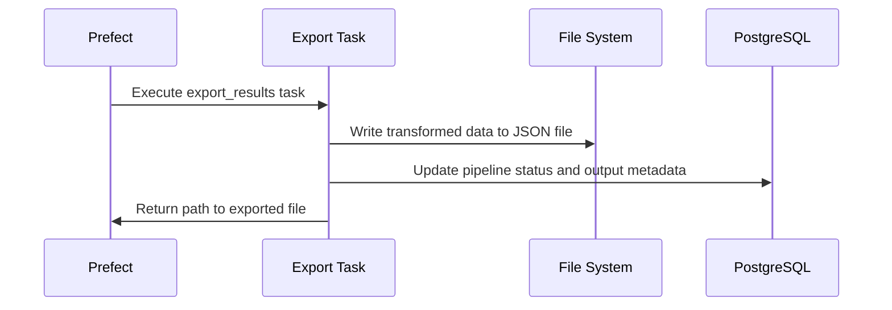

# Stage 5: Data Export

This document covers the final stage of the data pipeline — exporting the fully transformed dataset for downstream use. This stage is crucial for persisting the results and making them available for further analysis, visualization, or delivery to external systems.

## Purpose

The Data Export stage serves several key purposes:

1. **Finalize the pipeline output** by persisting the transformed data
2. **Prepare data for consumption** by other systems or users
3. **Track output metadata** such as file name, record count, and timestamps
4. **Signal completion** of the pipeline execution lifecycle

## Technology Used

- **Python**: Core scripting for data export
- **JSON**: Output format for ease of use
- **Prefect @task decorator**: To integrate with the pipeline
- **File System Storage**: For writing export files locally (demo use)

## Process Flow



## Implementation Details

### Task Definition

```python
@task(name="export_results")
async def export_results(pipeline_id: int, data: List[Dict[str, Any]]) -> str:
    # Task implementation...
```

### Key Steps

1. **Create output directory** if it does not exist
2. **Format output file name** using pipeline ID and timestamp
3. **Structure data** in an export-friendly format
4. **Write to disk** as a `.json` file
5. **Update pipeline record** in the database with file path and success status

### Sample Output Structure

```json
{
  "pipeline_id": 42,
  "generated_at": "2025-04-15T13:00:00Z",
  "record_count": 1000,
  "data": [
    {
      "id": 1,
      "name": "Item 1",
      "category": "A",
      "value": 100,
      "total_value": 500,
      "tier": "standard"
    },
    ...
  ]
}
```

## Output Location

All exports are saved to:

```bash
/app/data/output/
```

File names follow the pattern:

```bash
pipeline_<PIPELINE_ID>_results_<TIMESTAMP>.json
```

## Error Handling

- Wrapped in `try/except` block
- Updates database status as `failed` if exception occurs
- Logs any file system or serialization errors

## Monitoring Hooks

This stage updates status in the database and sends logs to Datadog. Monitored aspects:

- Records exported
- Export duration
- Errors encountered
- Output file name (in logs)

## Performance Characteristics

| Records | Approx Time |
| ------- | ----------- |
| 100     | <1 second   |
| 1,000   | \~1 second  |
| 10,000  | 1–3 seconds |

## Optimization Opportunities

- **Batch writing** to reduce memory usage
- **Parallel exports** for multiple files
- **Compression** (e.g., gzip) to reduce disk space
- **Export format** alternatives (e.g., Parquet, CSV)

## Integration Points

- **Input**: Transformed dataset from dbt task
- **Output**: JSON file on disk
- **Metadata**: Pipeline status and records processed updated in database
- **Monitoring**: Export logs and status to Datadog

## Testing This Stage

You can test this stage in isolation:

```python
from app.pipeline.flows import export_results
import asyncio

sample_data = [{"id": i, "name": f"Item {i}", "category": "A", "value": 100, "quantity": 2, "total_value": 200} for i in range(10)]
result = asyncio.run(export_results(pipeline_id=1, data=sample_data))
print("Exported file path:", result)
```

## Next Steps

Congratulations — this is the final step in the pipeline! From here, explore:

- [Monitoring with Datadog](../technologies/datadog.md)
- [How to extend the pipeline](../tutorials/extending.md)
- [Local deployment](../deployments/local.md)
