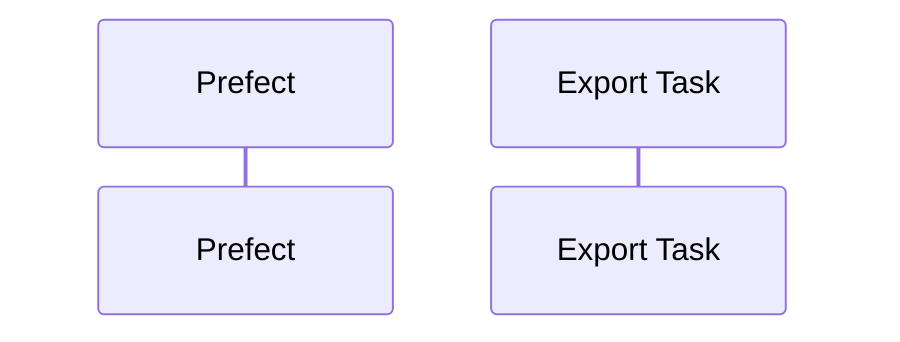

# Stage 5: Data Export

This document explains the data export stage of the pipeline, which formats and saves the final transformed data for downstream consumption.

## Purpose

The data export stage serves several key purposes:

1. **Prepare final data** for consumption by downstream systems
2. **Format and structure** data according to requirements
3. **Save data** to appropriate storage locations
4. **Document the output** with metadata
5. **Complete the pipeline** and update status information

## Technology Used

- **Python** as the core programming language
- **Prefect @task decorator** to define the task within the flow
- **JSON module** for data serialization
- **Celery** (optionally) for asynchronous file operations

## Process Flow

