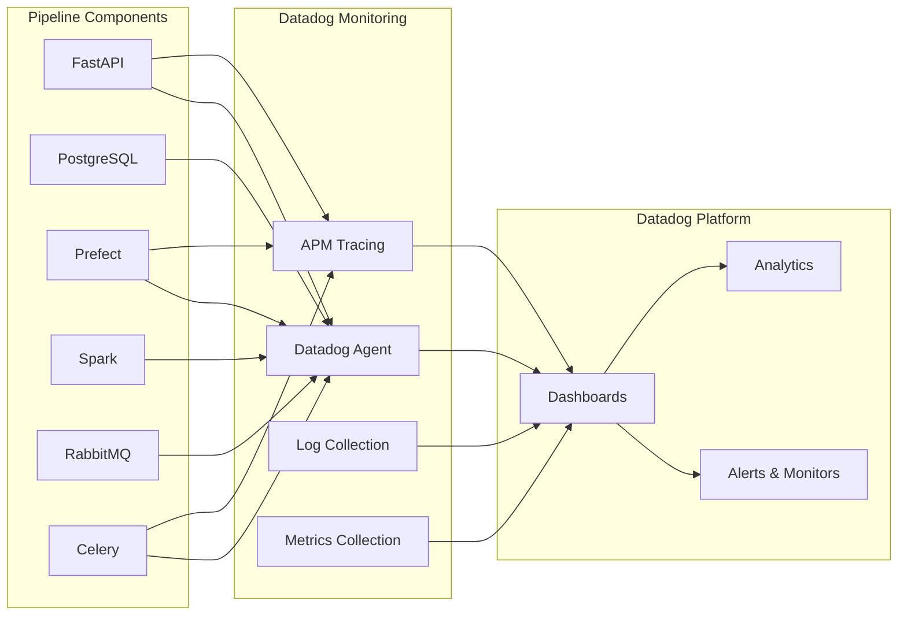

# Datadog Integration

[Datadog](https://www.datadoghq.com/) is a comprehensive monitoring and observability platform that provides complete visibility into the pipeline's performance, health, and behavior.

## Role in the Pipeline

Datadog serves several critical functions in our data pipeline:

1. **Unified Monitoring**: Collects metrics, traces, and logs from all components
2. **Performance Analysis**: Identifies bottlenecks and performance issues
3. **Error Detection**: Highlights failures and exceptions
4. **Real-time Visibility**: Provides dashboards showing current pipeline state
5. **Historical Analysis**: Enables trend analysis and capacity planning

## Monitoring Architecture



## Implementation Details

### Datadog Agent Configuration

The Datadog Agent is deployed as a container in the docker-compose stack:

```yaml
datadog-agent:
  image: gcr.io/datadoghq/agent:7
  container_name: datadog-agent
  pid: "host"
  volumes:
    - /var/run/docker.sock:/var/run/docker.sock:ro
    - /proc/:/host/proc/:ro
    - /sys/fs/cgroup/:/host/sys/fs/cgroup:ro
    - /etc/os-release:/host/etc/os-release:ro
    - ./datadog-agent/datadog.yaml:/etc/datadog-agent/datadog.yaml
  environment:
    - DD_API_KEY=${DD_API_KEY:-}
    - DD_ENV=${DD_ENV:-demo}
    - DD_SITE=${DD_SITE:-datadoghq.com}
    - DD_LOGS_ENABLED=true
    - DD_APM_ENABLED=true
    - DD_LOGS_CONFIG_CONTAINER_COLLECT_ALL=true
    - DD_CONTAINER_EXCLUDE="name:datadog-agent"
    - DD_HOSTNAME=${HOSTNAME:-datadog-data-jobs}
    - DD_HOSTNAME_TRUST_UTS_NAMESPACE=true
    - DD_APM_NON_LOCAL_TRAFFIC=true
    - DD_DOGSTATSD_NON_LOCAL_TRAFFIC=true
  privileged: true
  healthcheck:
    test: ["CMD", "agent", "health"]
    interval: 30s
    timeout: 10s
    retries: 3
  restart: unless-stopped
```

### APM Integration

Python services are instrumented with the Datadog Python tracer:

```python
# Auto-instrumentation with ddtrace-run
# In docker-compose:
command: ddtrace-run uvicorn app.main:app --host 0.0.0.0 --port 8000 --reload

# Manual instrumentation example:
from ddtrace import tracer

@tracer.wrap()
def my_function():
    # Function code here
```

### Logging Integration

Logs are sent to Datadog with correlation IDs for trace linking:

```python
import logging
from ddtrace import tracer

logger = logging.getLogger(__name__)

def process_data():
    # The current span ID will be automatically included in logs
    logger.info("Processing data batch")
```

### Metric Collection

The application reports custom metrics for business processes:

```python
from datadog import statsd

# Increment counter when pipeline runs
statsd.increment('pipeline.runs')

# Timing pipeline stages
with statsd.timed('pipeline.stage.process_time', tags=['stage:spark']):
    # Stage processing code
    process_data_with_spark()

# Gauge for records processed
statsd.gauge('pipeline.records_processed', len(records))
```

## Datadog Dashboards

### Pipeline Overview Dashboard


The main dashboard provides:

- Pipeline execution counts and success rates
- Average execution time per stage
- Error rates and types
- Resource utilization during pipeline runs

### Performance Dashboard

Focuses on performance metrics:

- Stage execution time trends
- Processing throughput
- Database query performance
- API response times

### Error Tracking Dashboard

Highlights issues and failures:

- Error counts by component
- Failure reasons
- Error trends
- Most problematic pipeline stages

## Key Metrics Tracked

| Metric                       | Description                   | Tags                   |
| ---------------------------- | ----------------------------- | ---------------------- |
| `pipeline.runs`              | Count of pipeline executions  | `status`, `user`       |
| `pipeline.duration`          | Total pipeline execution time | `pipeline_id`          |
| `pipeline.stage.duration`    | Execution time by stage       | `stage`, `pipeline_id` |
| `pipeline.records_processed` | Number of records processed   | `pipeline_id`          |
| `pipeline.errors`            | Error count                   | `stage`, `error_type`  |
| `spark.executors`            | Spark executor count          | `application_id`       |
| `postgresql.queries`         | Database query count          | `query_type`           |
| `rabbitmq.queue_length`      | Message queue depth           | `queue`                |

## Traces and Spans

Datadog APM captures distributed traces across the system:

1. **Web Request Spans**: User interactions with the UI
2. **Database Query Spans**: SQL queries to PostgreSQL
3. **Prefect Task Spans**: Individual pipeline task executions
4. **API Call Spans**: Internal service communications
5. **Celery Task Spans**: Background task executions

Span correlation provides end-to-end visibility from user action to task completion.

## Monitors and Alerts

Key monitors configured for the pipeline:

<details>
<summary>Pipeline Failure Monitor</summary>

```yaml
type: metric alert
query: sum(last_5m):sum:pipeline.runs{status:failed} > 3
message: |
  Multiple pipeline failures detected.

  {{#is_alert}}
  There have been {{value}} pipeline failures in the last 5 minutes.
  {{/is_alert}}

  {{#is_recovery}}
  Pipeline failures have returned to normal levels.
  {{/is_recovery}}
```

</details>

<details>
<summary>Slow Stage Execution Monitor</summary>

```yaml
type: metric alert
query: avg(last_15m):avg:pipeline.stage.duration{*} by {stage} > 300
message: |
  Pipeline stage {{stage.name}} is executing slowly.

  {{#is_alert}}
  Average execution time: {{value}}s (threshold: 300s)
  {{/is_alert}}
```

</details>

<details>
<summary>Error Rate Monitor</summary>

```yaml
type: metric alert
query: sum(last_5m):sum:pipeline.errors{*} / sum:pipeline.runs{*} > 0.1
message: |
  High pipeline error rate detected.

  {{#is_alert}}
  Error rate: {{value}} (threshold: 0.1)
  {{/is_alert}}
```

</details>

## Log Management

Logs from all components are collected and structured:

- **FastAPI**: Web server and application logs
- **Prefect**: Flow and task execution logs
- **Spark**: Processing logs
- **PostgreSQL**: Database logs
- **RabbitMQ**: Message broker logs
- **Celery**: Task worker logs

Log patterns are defined to automatically extract key fields like:

- Pipeline ID
- Stage name
- Error types
- Record counts

## Setting Up Datadog

To enable Datadog monitoring:

1. **Create a Datadog account** if you don't have one
2. **Get your API key** from the Datadog dashboard
3. **Add your API key** to the `.env` file:
   ```
   DD_API_KEY=your_api_key_here
   ```
4. **Start with the Datadog profile**:
   ```bash
   docker-compose --profile with-datadog up -d
   ```

## Customizing Monitoring

To customize Datadog monitoring:

1. **Modify Environment Variables** in `.env` or `docker-compose.yml`
2. **Adjust Agent Configuration** in `datadog-agent/datadog.yaml`
3. **Add Custom Metrics** using the Datadog Python client
4. **Create Custom Dashboards** in the Datadog UI
5. **Define Additional Monitors** for specific alerting needs

## Best Practices

1. **Use Consistent Tagging**: Apply consistent tags across metrics, traces, and logs
2. **Instrument Critical Paths**: Ensure all key application flows are traced
3. **Track Business Metrics**: Monitor not just technical but business-relevant metrics
4. **Correlate Data**: Link metrics, traces, and logs for better troubleshooting
5. **Set Meaningful Alerts**: Configure actionable alerts with clear thresholds

## Troubleshooting

<details>
<summary>Datadog Agent not collecting metrics</summary>

**Problem**: No metrics appear in Datadog.

**Solution**:

1. Check if the Datadog Agent container is running
2. Verify the API key is correct
3. Check the Agent logs: `docker logs datadog-agent`
4. Ensure the Agent can reach the Datadog intake endpoint
</details>

<details>
<summary>Missing APM traces</summary>

**Problem**: Application traces don't appear in Datadog APM.

**Solution**:

1. Verify services are started with `ddtrace-run`
2. Check if the Agent has APM enabled: `DD_APM_ENABLED=true`
3. Ensure non-local traffic is allowed: `DD_APM_NON_LOCAL_TRAFFIC=true`
4. Check application logs for tracing errors
</details>

<details>
<summary>Logs not appearing</summary>

**Problem**: Logs aren't visible in Datadog.

**Solution**:

1. Verify logs are enabled: `DD_LOGS_ENABLED=true`
2. Check container log collection: `DD_LOGS_CONFIG_CONTAINER_COLLECT_ALL=true`
3. Examine the Agent status: `docker exec datadog-agent agent status`
4. Check for log processing errors in Agent logs
</details>

## Further Reading

- [Datadog Documentation](https://docs.datadoghq.com/)
- [Python APM Documentation](https://docs.datadoghq.com/tracing/trace_collection/dd_libraries/python/)
- [Docker Monitoring Guide](https://www.datadoghq.com/blog/monitor-docker-datadog/)
- [Datadog Blog: Monitoring Data Pipelines](https://www.datadoghq.com/blog/data-pipeline-monitoring-best-practices/)
