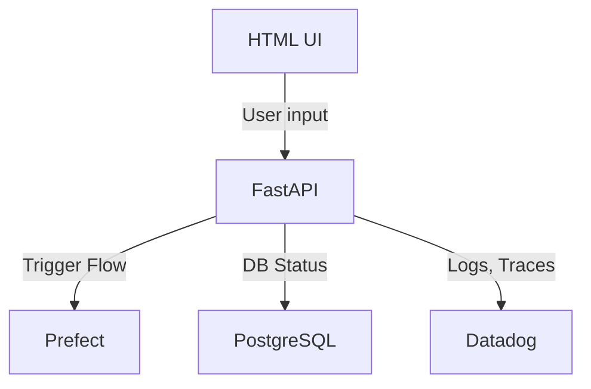

# FastAPI Overview

FastAPI is the core web framework used to provide the UI and API interface for the pipeline demo. It powers both user interactions and machine-triggered automation.

## Responsibilities

FastAPI is responsible for:

- Serving the HTML web interface (via Jinja2 templates)
- Handling API requests for creating and monitoring pipelines
- Providing endpoints for real-time pipeline status updates
- Initiating flow runs in Prefect
- Returning pipeline metadata for the UI

## Key Features Used

- **Async routing**: Enables non-blocking I/O for DB and Prefect calls
- **Pydantic models**: Used for input validation and response schemas
- **Dependency injection**: For managing database sessions
- **Templating engine**: Renders `index.html`, `pipeline.html` for dashboard views
- **Custom exception handling**: Handles 404s and application errors

## API Structure

```plaintext
GET    /pipelines/                # List all pipelines
GET    /pipelines/{id}           # Get a specific pipeline
POST   /pipelines/               # Create new pipeline
POST   /status-update/           # Update pipeline or stage status
GET    /pipelines/{id}/stages    # List stages for a pipeline
POST   /trigger/{pipeline_id}    # Trigger pipeline execution
```

## Component Integration



## Example Route

```python
@router.get("/pipelines/", response_model=List[PipelineResponse])
def get_pipelines(skip: int = 0, limit: int = 100, db: Session = Depends(get_db)):
    return crud.get_pipelines(db, skip=skip, limit=limit)
```

## Template Integration

Templates are rendered using Jinja2. For example:

```python
from fastapi import Request
from fastapi.templating import Jinja2Templates

templates = Jinja2Templates(directory="app/templates")

@app.get("/")
def dashboard(request: Request, db: Session = Depends(get_db)):
    pipelines = crud.get_pipelines(db)
    return templates.TemplateResponse("index.html", {"request": request, "pipelines": pipelines})
```

## Observability

FastAPI emits logs and metrics to Datadog:

- **APM Traces**: Each request is traced from endpoint to DB query
- **Logs**: Info and error logs are collected and correlated
- **Metrics**: Response time, request counts, error rates

## Testing Endpoints

You can test the API with curl or httpx:

```bash
curl http://localhost:8000/pipelines/
```

```python
import httpx
r = httpx.get("http://localhost:8000/pipelines/")
print(r.json())
```

## Summary

FastAPI acts as the front door to the pipeline — handling user actions, triggering backend flows, and reporting status in real time. It's fast, asynchronous, and tightly integrated with all other services in the system.
