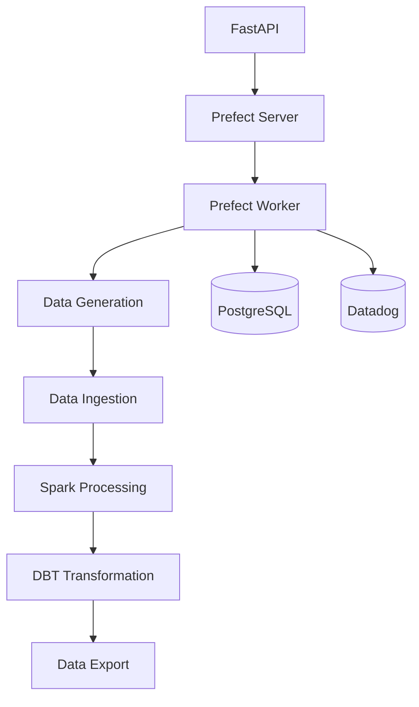

# Prefect Overview

[Prefect](https://www.prefect.io/) is a modern workflow orchestration tool used to define, run, and monitor data pipelines.

## Responsibilities

Prefect serves as the orchestration backbone of the pipeline, providing:

1. **Workflow Orchestration**: Defining the sequence and dependencies of tasks
2. **Execution Tracking**: Monitoring the progress of pipeline runs
3. **Error Handling**: Managing retries and failure scenarios
4. **Observability**: Providing visibility into pipeline execution
5. **Worker-Based Execution**: Handling task processing through a queue system

## Execution Flow



## Flow Definition

The main pipeline is defined in [`app/pipeline/flows.py`](../../app/pipeline/flows.py):

```python
@flow(name="Data Pipeline", log_prints=True)
async def run_data_pipeline_flow(pipeline_id: int, record_count: int = 1000):
    # Executes 5 pipeline stages
```

## Prefect Concepts Used

### Flows

Decorated with `@flow`, the main flow manages the entire lifecycle of the pipeline:

```python
@flow(name="Data Pipeline", log_prints=True)
async def run_data_pipeline_flow(...):
```

### Tasks

Each pipeline stage is wrapped in a Prefect `@task`, supporting retries and metadata:

```python
@task(name="generate_data", retries=2)
async def generate_data(...):
```

### Work Pools and Queues

The system uses a local `process` work pool via Prefect's new worker model:

```bash
prefect worker start -p default
```

Deployments are created dynamically using `flow.deploy()`.

## Observability with Datadog

Prefect integrates with Datadog for full pipeline visibility:

- **APM Traces**: Each task is wrapped in an APM span
- **Metrics**: Execution durations, success/failure rates
- **Logs**: Task logs sent to Datadog with contextual tags

Example metrics include:

| Metric                  | Description                   |
| ----------------------- | ----------------------------- |
| `prefect.flow.runs`     | Count of flow runs            |
| `prefect.task.success`  | Task success count            |
| `prefect.task.failed`   | Task failure count            |
| `prefect.flow.duration` | Total execution time per flow |

## UI Access

The Prefect dashboard is available at:

```bash
http://localhost:4200
```

Use it to:

- View flow and task runs
- Inspect logs and failure causes
- Manually trigger new deployments

## Integration Highlights

- **FastAPI** triggers deployments via Prefect API
- **PostgreSQL** is updated from within tasks to track status
- **Datadog** collects metrics, traces, and logs from task runs

## Common Issues and Solutions

<details>
<summary>Worker can't connect to server</summary>

Check container networking, server health, and environment variables.

</details>

<details>
<summary>Deployment not found</summary>

Ensure the deployment is created and matches expected name.

</details>

<details>
<summary>Flow run stuck in pending</summary>

Confirm worker is active and connected to the correct queue.

</details>

## Best Practices

1. Use retries and meaningful task names
2. Tag tasks for filtering in the UI
3. Use log levels and print logging in flows
4. Store flow outputs and metadata in structured formats

## Resources

- [Prefect Documentation](https://docs.prefect.io/)
- [Prefect GitHub](https://github.com/PrefectHQ/prefect)
- [Prefect Slack Community](https://prefect.io/slack)
- [Prefect Cloud](https://app.prefect.cloud/) (optional managed orchestration)
