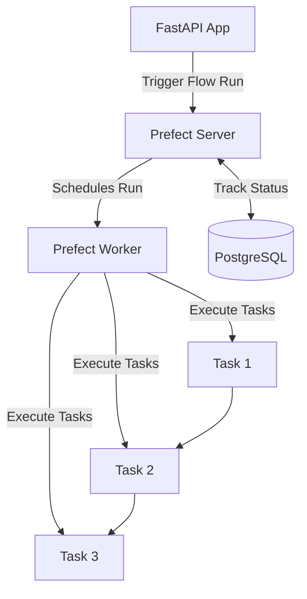

# Prefect Integration

[Prefect](https://www.prefect.io/) is a modern workflow orchestration tool that helps us build, run, and monitor data pipelines.

## Role in the Pipeline

Prefect serves as the backbone of our data pipeline, providing:

1. **Workflow Orchestration**: Defining the sequence and dependencies of tasks
2. **Execution Tracking**: Monitoring the progress of pipeline runs
3. **Error Handling**: Managing retries and failure scenarios
4. **Observability**: Providing visibility into pipeline execution
5. **Deployment Model**: Worker-based execution of pipeline runs

## Architecture



## Key Components

### Prefect Server

The Prefect Server provides:

- API for creating and managing flow runs
- UI for monitoring execution
- Storage for flow run history
- Work queue management

### Prefect Worker

The Prefect Worker:

- Picks up work from the work queue
- Executes flow runs in the specified environment
- Reports status back to the server
- Handles retries and failure logic

### Flow Definition

```python
@flow(name="Data Pipeline", log_prints=True)
async def run_data_pipeline_flow(pipeline_id: int, record_count: int = 1000):
    """Main flow that orchestrates the entire data pipeline"""
    # Flow implementation here
```

### Task Definitions

```python
@task(name="generate_data", retries=2)
async def generate_data(pipeline_id: int, records: int = 1000) -> str:
    """Generate a sample dataset for processing"""
    # Task implementation here
```

## Prefect Concepts Used

### Flows

Flows are the main unit of work in Prefect. In our pipeline, we define a single main flow that orchestrates the entire pipeline process.

<details>
<summary>Flow Decorator Details</summary>

The `@flow` decorator marks a function as a Prefect flow:

```python
@flow(
    name="Data Pipeline",        # Name shown in the UI
    log_prints=True,             # Log print statements
    retries=0,                   # Flow-level retries
    retry_delay_seconds=None,    # Delay between retries
)
```

</details>

### Tasks

Tasks are the individual units of work within a flow. In our pipeline, each stage is defined as a separate task.

<details>
<summary>Task Decorator Details</summary>

The `@task` decorator marks a function as a Prefect task:

```python
@task(
    name="task_name",           # Name shown in the UI
    retries=2,                  # Number of retries on failure
    retry_delay_seconds=30,     # Delay between retries
    tags=["tag1", "tag2"],      # Tags for filtering in the UI
)
```

</details>

### Work Pools and Queues

Work pools define where flow runs execute, while queues help prioritize and route work.

<details>
<summary>Work Pool Configuration</summary>

Our pipeline uses a "Process" work pool named "default", which executes flow runs locally in the worker container.

```python
# Creating a work pool via the API
pool = await client.create_work_pool(
    name="default",
    type="process"
)
```

</details>

### Deployments

Deployments specify how a specific flow should be run, including parameters and infrastructure.

<details>
<summary>Deployment Creation</summary>

```python
# Create a deployment from our flow
from pathlib import Path
from prefect import flow

my_flow.from_source(
    source=str(Path(__file__).parent),
    entrypoint="flows.py:run_data_pipeline_flow",
).deploy(
    name="data-pipeline-deployment",
    work_pool_name="default",
)
```

</details>

## Integration with Other Components

### FastAPI Integration

The FastAPI application initiates pipeline runs through the Prefect API:

```python
async def trigger_prefect_flow(pipeline_id: int):
    """Trigger a Prefect flow for the pipeline"""
    from prefect.client.orchestration import get_client

    client = get_client()
    # Find our deployment
    deployments = await client.read_deployments()
    for deployment in deployments:
        if deployment.name == "data-pipeline-deployment":
            deployment_id = deployment.id

    # Create a flow run
    flow_run = await client.create_flow_run_from_deployment(
        deployment_id=deployment_id,
        parameters={"pipeline_id": pipeline_id, "record_count": 1000}
    )
```

### Database Integration

Prefect tasks update the pipeline status in the PostgreSQL database:

```python
async def update_pipeline_status(
    pipeline_id: int,
    stage_name: Optional[str] = None,
    status: Optional[str] = None,
    message: Optional[str] = None
):
    """Helper function to update pipeline and stage status"""
    # Implementation here
```

### Datadog Integration

Prefect is integrated with Datadog for monitoring:

- Execution metrics are captured by the Datadog agent
- Task spans are traced for performance analysis
- Logs are forwarded to Datadog for centralized logging

## UI and Monitoring

The Prefect UI is accessible at `http://localhost:4200` and provides:

1. **Flow Runs**: List of all pipeline executions
2. **Flow Run Details**: Detailed view of a specific run
3. **Task Runs**: Individual task executions within a flow
4. **Logs**: Detailed logs for debugging


## Configuration

### Environment Variables

| Variable              | Purpose                | Default                        |
| --------------------- | ---------------------- | ------------------------------ |
| PREFECT_API_URL       | Server API URL         | http://prefect-server:4200/api |
| PREFECT_UI_API_URL    | UI API URL (browser)   | http://localhost:4200/api      |
| PREFECT_LOGGING_LEVEL | Log verbosity          | INFO                           |
| PREFECT_HOME          | Prefect home directory | /root/.prefect                 |

### Docker Services

The `docker-compose.yml` file defines two Prefect-related services:

1. **prefect-server**: Runs the Prefect API and UI
2. **prefect-worker**: Executes flow runs from the work queue

## Common Issues and Solutions

<details>
<summary>Worker can't connect to server</summary>

**Problem**: The worker service logs show connection errors to the Prefect server.

**Solution**:

1. Check network connectivity between containers
2. Verify PREFECT_API_URL is set correctly in the worker environment
3. Ensure the server is healthy and running
</details>

<details>
<summary>Deployment not found</summary>

**Problem**: When triggering a pipeline, you get a "Deployment not found" error.

**Solution**:

1. Run `python app/pipeline/deploy.py` to create the deployment
2. Check that the worker pool exists
3. Verify deployment names match in the code
</details>

<details>
<summary>Flow run stuck in pending</summary>

**Problem**: Flow runs stay in "Pending" state and don't get picked up.

**Solution**:

1. Check if the worker is running
2. Verify the worker is connected to the correct work pool
3. Check for work queue name mismatches
</details>

## Best Practices

1. **Use descriptive names** for flows and tasks
2. **Add appropriate retry logic** to tasks that may experience transient failures
3. **Use tags** to categorize and filter flows and tasks
4. **Leverage flow and task-level logging** for observability
5. **Structure flows hierarchically** for complex pipelines

## Version Information

This pipeline uses Prefect 3.0, which introduces several changes from previous versions:

- New worker model replacing the previous agent model
- Updated deployment API using `flow.deploy()` instead of `Deployment.build_from_flow()`
- Enhanced work pools and work queues for better execution control
- Improved performance and scalability

## Resources

- [Prefect Documentation](https://docs.prefect.io/)
- [Prefect GitHub Repository](https://github.com/PrefectHQ/prefect)
- [Prefect Community Slack](https://prefect.io/slack)
- [Prefect Cloud](https://app.prefect.cloud/) (managed alternative to self-hosted)
