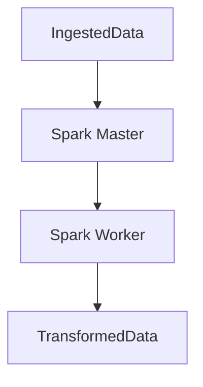

# Spark Overview

Apache Spark is used in this pipeline for scalable data processing. While the current implementation simulates Spark-like behavior, the design supports scaling to real distributed processing environments.

## Responsibilities

- Perform CPU-intensive transformations on ingested data
- Calculate derived metrics like total values
- Simulate distributed processing in the pipeline demo

## Execution Role

In the current architecture:

- Spark is defined as a separate service using Bitnami’s `spark:3.3.0` image
- The master and worker services are deployed in Docker Compose
- The actual task is simulated with Python logic in `flows.py`, but can be swapped with PySpark code

## Diagram



## Simulated Processing Example

```python
@task(name="process_with_spark")
async def process_with_spark(pipeline_id: int, data: List[Dict[str, Any]]) -> List[Dict[str, Any]]:
    # Simulate distributed processing
    for record in data:
        record["total_value"] = record["value"] * record["quantity"]
```

In a real Spark implementation, the data would be converted into a Spark DataFrame and processed in parallel.

## Real Spark Integration (Future Ready)

You could integrate with Spark like this:

```python
from pyspark.sql import SparkSession
spark = SparkSession.builder.master("spark://spark-master:7077").appName("Pipeline").getOrCreate()
df = spark.read.json("/app/data/input/sample.json")
df = df.withColumn("total_value", df["value"] * df["quantity"])
df.write.json("/app/data/output/result.json")
```

## Observability

Datadog monitors Spark via the Agent:

- **Metrics**: Executor count, job runtime, memory usage
- **Logs**: From master and worker containers
- **Traces**: Not used in simulated Spark, but task traced via Prefect

Example monitored metric:

| Metric               | Description                      |
| -------------------- | -------------------------------- |
| `spark.job.duration` | Time to complete a Spark job     |
| `spark.executors`    | Number of active Spark executors |

## Docker Integration

```yaml
spark-master:
  image: bitnami/spark:3.3.0
  environment:
    - SPARK_MODE=master
  ports:
    - "8080:8080"
    - "7077:7077"

spark-worker:
  image: bitnami/spark:3.3.0
  environment:
    - SPARK_MODE=worker
    - SPARK_MASTER_URL=spark://spark-master:7077
```

UI is available at:

```bash
http://localhost:8080
```

## Performance Notes

While the current demo processes data sequentially for simplicity, real Spark jobs offer:

- Distributed processing across nodes
- Fault tolerance and retry mechanisms
- Optimized handling of large-scale datasets

## Summary

Spark represents the processing engine of the pipeline. In this demo, it is simulated using Python for ease of deployment but can be easily swapped with actual PySpark jobs. It integrates with the rest of the stack via file input/output and is observable through Datadog.
